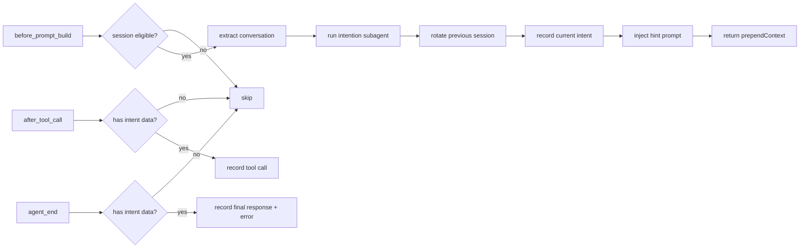

# Intention Hint Plugin

[](https://github.com/openclaw/openclaw)
[](https://opensource.org/licenses/MIT)

An OpenClaw plugin that pre-scans user intent before main-agent replies and injects routing hints via the `before_prompt_build` hook. It also tracks session-level metrics (tool calls, skills used, timestamps) via `after_tool_call` and `agent_end` hooks.

## Architecture

```
index.ts
  └─ plugin.ts → createPlugin()
       │
       ├─ intent-loader.ts → defaultCatalog (loads intent .md files from intentsDir)
       ├─ subagent.ts → runIntentionSubagent() (classifies intent via lightweight sub-agent)
       │
       ├─ hooks.ts → createHookHandlers()
       │    ├─ onBeforePromptBuild → rotate() → record() → write() → inject hint
       │    ├─ onAfterToolCall → record() → write() (tracks tool usage)
       │    └─ onAgentEnd → record() → write() (tracks final result)
       │
       ├─ hooks.ts → limitConversationTurns() → extract recent user/assistant turns
       │    └─ conversation-extract.ts (turn extraction + text processing)
       │
       ├─ session-tracker.ts → SessionTracker (JSON session persistence)
       │    └─ sessions/<sessionId>.json
       │
       ├─ prompt-builder.ts → buildPromptPrefix() (builds injected hint text)
       │
       ├─ session.ts → session guards (isEnabledForAgent, isEligibleInteractiveSession, etc.)
       │
       └─ config.ts → resolveConfig() (zod schema validation with contextWindow)
            └─ types.ts (all type definitions)
```

### Module Responsibilities

| Module                    | Purpose                                                                          |
| ------------------------- | -------------------------------------------------------------------------------- |
| `plugin.ts`               | Plugin entry point, registers hooks on OpenClaw lifecycle events                 |
| `hooks.ts`                | Event handlers for `before_prompt_build`, `after_tool_call`, `agent_end`         |
| `subagent.ts`             | Runs the intention classification sub-agent with model selection                 |
| `intent-loader.ts`        | Loads and catalogs intent definitions from YAML-frontmatter `.md` files          |
| `session-tracker.ts`      | Persist session data (intents, tools, skills) to `sessions/` JSON files          |
| `conversation-extract.ts` | Extract and truncate recent conversation turns for intent context                |
| `prompt-builder.ts`       | Construct the untrusted context hint injected into the main agent prompt         |
| `session.ts`              | Session eligibility guards (agent allow-list, chat type, internal run detection) |
| `config.ts`               | Zod schema validation with defaults and clamping for plugin configuration        |

### Hook Execution Flow



## How it works

1. **Before Prompt Build** — When the user sends a message, the plugin intercepts the prompt construction.
2. **Fast Sub-agent** — A lightweight sub-agent classifies the intent by matching against dynamically loaded intent definitions.
3. **Dynamic Intents** — Intent definitions live in YAML-frontmatter Markdown files under `intents/`. Add, remove, or edit intents without rebuilding the plugin. Each intent file specifies:
   - `id` — unique identifier (e.g. `chat`, `memory-recent`)
   - `name` — human-readable label
   - `enabled` — whether the intent is active
   - `triggers` — natural-language descriptions that guide the classifier
   - `examples` — few-shot examples for the classifier
   - Markdown body — the injection prompt body shown to the main agent after classification
4. **Structured Output** — The classifier returns a key-value format:
   ```
   intent: <id> (<name>)
   reason: <brief reason for classification>
   goal: <what the user likely wants to achieve>
   confidence: <0.0 to 1.0>
   complexity: <low | medium | high>
   suggestion: <optional correction or recommendation>
   ```
   The plugin parses this into an `IntentionResult` and injects the matching intent's body as untrusted context.
5. **Recent Context Support** — In `queryMode: "recent"`, the plugin extracts recent `user` / `assistant` turns from `event.messages`, strips previously injected plugin metadata blocks, and builds a recent conversation tail for the classifier.
6. **Internal Run Guard** — The classifier skips internal runs for `active-memory`, `intention-hint`, and generic `:subagent:` session keys.
7. **Session Tracking** — When intent classification succeeds, the plugin records session data (`sessions/<sessionId>.json`):
   - `current.input` — the user's latest message
   - `current.intent` — classification results (`IntentState`)
   - `current.toolCalls` — tool invocations captured via `after_tool_call`
   - `current.skillsUsed` — auto-detected skills from `read` calls to `SKILL.md` files
   - `current.result` / `current.error` — agent response and error info from `agent_end`
   - `current.timestamps` — start/end timestamps
   - `history` — reserved for storing past turn snapshots

## Session Data Structure

```typescript
interface SessionData {
  sessionId: string;
  sessionKey?: string;
  agentId?: string;
  current: {
    input?: string;
    intent: {
      input?: RecentTurn[];
      result?: IntentionResult;
    };
    skillsUsed?: SkillRecord[];
    toolCalls?: Array<{
      name: string;
      params: Record<string, unknown>;
      result?: string;
      error?: string;
      durationMs?: number;
    }>;
    result?: string;
    error?: string;
    timestamps?: { start?: string; end?: string };
  };
  history?: (typeof current)[];
}
```

## Installation

This plugin is a workspace package inside `/home/wei/Projects/openclaw/extensions/`.
Build it with:

```bash
cd extensions/intention-hint
pnpm install
pnpm run build
```

## Configuration (`openclaw.json`)

```json5
{
  plugins: {
    entries: {
      "intention-hint": {
        enabled: true,
        config: {
          agents: ["main"],
          intentDeny: {
            main: ["MEMORY_*"], // deny matching intent IDs for main
            "research-*": ["CHAT", "TYPO"],
            "*": ["AGENT_ADMIN"], // global deny for every agent
          },
          model: "google/gemini-3-flash", // lightweight scanner model
          modelFallback: "openai/gpt-5-mini",
          allowedChatTypes: ["direct"],
          allowedChatIds: [],
          deniedChatIds: [],
          queryMode: "recent",
          contextWindow: {
            user: { turns: 5, chars: 500 },
            assistant: { turns: 3, chars: 300 },
          },
          timeoutMs: 3000,
          intentsDir: "./intents",
          complexityPrompts: {
            low: "Custom low-complexity prompt...",
            medium: "Custom medium-complexity prompt...",
            high: "Custom high-complexity prompt...",
          },
        },
      },
    },
  },
}
```

### Configuration Reference

| Option              | Type       | Default       | Description                                                                                              |
| ------------------- | ---------- | ------------- | -------------------------------------------------------------------------------------------------------- |
| `agents`            | `string[]` | `["*"]`       | Which agents trigger the plugin. Use `["*"]` for all agents.                                             |
| `intentDeny`        | `object`   | `{}`          | Per-agent deny list of intent IDs. Keys support `*` glob patterns.                                       |
| `model`             | `string`   | —             | Lightweight model for the intention scanner. Falls back to the agent's default if empty.                 |
| `modelFallback`     | `string`   | —             | Fallback model when `config.model` cannot be resolved.                                                   |
| `allowedChatTypes`  | `string[]` | `["direct"]`  | Which chat types are eligible (`direct`, `group`, `channel`, `explicit`).                                |
| `allowedChatIds`    | `string[]` | `[]`          | Allow-list of chat IDs.                                                                                  |
| `deniedChatIds`     | `string[]` | `[]`          | Deny-list of chat IDs.                                                                                   |
| `queryMode`         | `string`   | `"recent"`    | Context sent to scanner: `message` (latest only), `recent` (recent turns), or `full` (full history).     |
| `timeoutMs`         | `number`   | `3000`        | Budget in milliseconds for the intention scanner sub-agent.                                              |
| `intentsDir`        | `string`   | `"./intents"` | Directory containing dynamic intent `.md` files. Resolved relative to the plugin installation directory. |
| `complexityPrompts` | `object`   | `{}`          | Custom prompts per complexity level. Overrides built-in defaults for `low`, `medium`, or `high`.         |

#### `complexityPrompts` Object

The plugin injects a complexity-specific guidance prompt **after** the intent definition prompt. Each key is optional; unset keys use the built-in default.

```json
{
  "complexityPrompts": {
    "low": "Custom low-complexity prompt...",
    "medium": "Custom medium-complexity prompt...",
    "high": "Custom high-complexity prompt..."
  }
}
```

Built-in behavior (configurable via `complexityPrompts`):

- **`low`** — Fast, concise, minimal overhead. For quick tasks and simple questions.
- **`medium`** — Balanced execution with step-by-step planning and clarification. Pauses to ask when details are ambiguous.
- **`high`** — Deep investigation using sub-agents for large codebases, structured multi-step planning with user review before execution.

## Intent Definition Format

Create a `.md` file in the `intents/` directory:

```markdown
---
id: RESEARCH_GENERAL
name: General Research Query
enabled: true
triggers:
  - "User is asking for factual or explanatory information that should be researched from external sources"
examples:
  - "Tell me about quantum computing"
  - "Explain blockchain consensus mechanisms"
---

Detected "general research" intent. The user wants factual or explanatory information supported by external sources.

## Guidelines

- Do not answer factual questions from memory alone.
- Prefer authoritative and directly relevant sources.
- Search for current external information:
  web_search({ query: "<topic keywords>" })
```

### Frontmatter Fields

| Field      | Required | Type       | Description                                                 |
| ---------- | -------- | ---------- | ----------------------------------------------------------- |
| `id`       | **yes**  | `string`   | Unique identifier (letters, numbers, hyphens, underscores). |
| `name`     | no       | `string`   | Human-readable label (defaults to `id`).                    |
| `enabled`  | no       | `boolean`  | Whether this intent is active (defaults to `true`).         |
| `triggers` | **yes**  | `string[]` | Natural-language descriptions that guide the classifier.    |
| `examples` | no       | `string[]` | Few-shot examples for the classifier.                       |

### Intent Writing Rules

#### 1. Split responsibilities clearly

- **Frontmatter** is for **classification**.
- **Markdown body** is for the **main agent hint** injected after classification.

#### 2. Keep frontmatter narrow and classifier-friendly

- Use `triggers` to describe the **boundary** of the intent.
- Merge similar trigger descriptions instead of listing many near-duplicates.
- Use `examples` to preserve diversity without expanding the scope.
- Do not put tool instructions, workflows, or long reasoning guides in frontmatter.

#### 3. Keep the body short and single-intent

- Only describe behavior that belongs to that intent.
- Do not restate broad system rules that already exist elsewhere.
- Do not mix multiple intent families into one file.
- Prefer a small, direct prompt over a long SOP-style document.

#### 4. Use a consistent body structure

Recommended shape:

```markdown
Detected "<intent>" intent. <One-sentence explanation.>

## Guidelines

- ...
- ...

## Response Strategy

- ...
- ...
```

#### 5. Describe skill usage with timing or purpose

When a skill is relevant, prefer this format:

```markdown
- Read a large Markdown document by section:
  `skill: treemd`
- Read a code file by symbols before summarizing implementation details:
  `skill: cx`
```

Use short, intent-specific purpose lines. Avoid long skill descriptions.

#### 6. Describe tool usage with exact formats

For direct tool hints, use the explicit call shape:

```markdown
memory_search({ query: "<subject_A_keywords>", corpus: "memory", maxResults: 5, minScore: 0.1 })
read({ path: "<file>" })
web_search({ query: "<topic keywords>" })
web_fetch({ url: "<authoritative_url>" })
```

If the intent needs CLI usage through `exec`, show it as a shell block:

```bash
git status
git diff
```

## Plugin Hooks

| Hook                  | Handler               | Purpose                                           | Condition                                          |
| --------------------- | --------------------- | ------------------------------------------------- | -------------------------------------------------- |
| `before_prompt_build` | `onBeforePromptBuild` | Runs intention classifier, injects hint prompt    | Only for eligible sessions; skips internal runs    |
| `after_tool_call`     | `onAfterToolCall`     | Records tool invocation metrics                   | Only for sessions with prior intent classification |
| `agent_end`           | `onAgentEnd`          | Records final response, errors, and end timestamp | Only for sessions with prior intent classification |

The `after_tool_call` and `agent_end` hooks are guarded by `hasIntentData()` — they only record if `before_prompt_build` successfully classified an intent for that session.

## Session Tracking

Session data is persisted to JSON files under `sessions/` within the plugin root directory.
Files are named `<sessionId>.json` and overwritten on each session completion.

Example `sessions/abc-123.json`:

```json
{
  "sessionId": "abc-123",
  "sessionKey": "main:direct:user123",
  "agentId": "main",
  "current": {
    "input": "How does the memory system work?",
    "intent": {
      "input": [{ "role": "user", "text": "How does the memory system work?" }],
      "result": {
        "intent": "RESEARCH_GENERAL",
        "reason": "User is asking about system internals",
        "goal": "Understand memory architecture",
        "confidence": 0.85,
        "complexity": "medium"
      }
    },
    "toolCalls": [
      {
        "name": "read",
        "params": {
          "path": "/home/wei/.config/opencode/skills/memory/SKILL.md"
        },
        "result": "Memory system documentation...",
        "durationMs": 120
      }
    ],
    "skillsUsed": [
      {
        "name": "memory",
        "path": "/home/wei/.config/opencode/skills/memory/SKILL.md"
      }
    ],
    "result": "The memory system uses a graph-based...",
    "timestamps": {
      "start": "2026-05-27T02:00:00.000Z",
      "end": "2026-05-27T02:00:15.000Z"
    }
  }
}
```

## Development

```bash
pnpm install
pnpm run build
pnpm run typecheck
pnpm test
```

Tests use Vitest. Run `pnpm test` to execute the full test suite with type checking.
